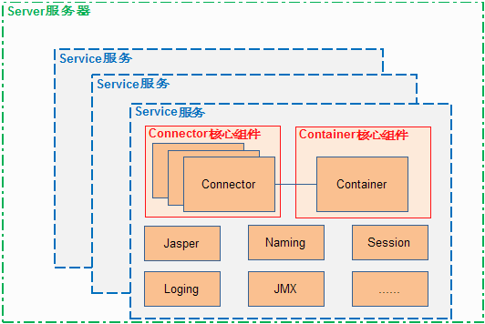
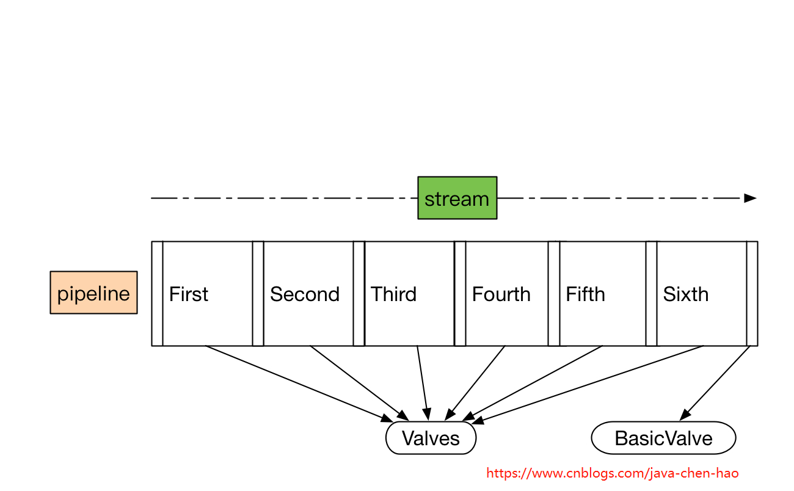
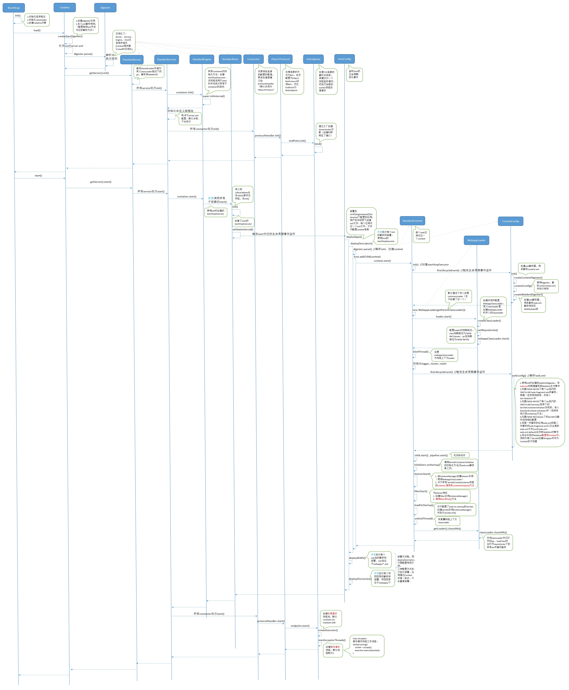
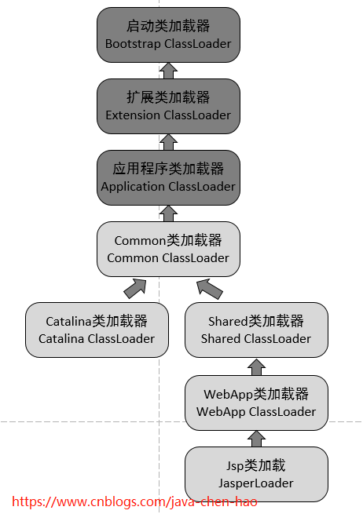

## Welcome to Apache Tomcat!

### 整体架构图

从上图我们看出，最核心的两个组件--连接器（Connector）和容器（Container）起到心脏的作用，他们至关重要！他们的作用如下：
1. Connector用于处理连接相关的事情，并提供Socket与Request和Response相关的转化;
2. Container用于封装和管理Servlet，以及具体处理Request请求；

一个Tomcat中只有一个Server，一个Server可以包含多个Service，一个Service只有一个Container，但是可以有多个Connectors，这是因为一个服务可以有多个连接，如同时提供Http和Https链接，也可以提供向相同协议不同端口的连接,示意图如下（Engine、Host、Context下边会说到）：

多个 Connector 和一个 Container 就形成了一个 Service，有了 Service 就可以对外提供服务了，但是 Service 还要一个生存的环境，必须要有人能够给她生命、掌握其生死大权，那就非 Server 莫属了！所以整个 Tomcat 的生命周期由 Server 控制。

### 分析各个组件的功能
1. Server表示服务器，提供了一种优雅的方式来启动和停止整个系统，不必单独启停连接器和容器
2. Service表示服务，Server可以运行多个服务。比如一个Tomcat里面可运行订单服务、支付服务、用户服务等等
3. 每个Service可包含多个Connector和一个Container。因为每个服务允许同时支持多种协议，但是每种协议最终执行的Servlet却是相同的
4. Connector表示连接器，比如一个服务可以同时支持AJP协议、Http协议和Https协议，每种协议可使用一种连接器来支持
5. Container表示容器，可以看做Servlet容器
    * Engine -- 引擎
    * Host -- 主机
    * Context -- 上下文
    * Wrapper -- 包装器
6. Service服务之下还有各种支撑组件
    * Manager -- 管理器，用于管理会话Session
    * Logger -- 日志器，用于管理日志
    * Loader -- 加载器，和类加载有关，只会开放给Context所使用
    * Pipeline -- 管道组件，配合Valve实现过滤器功能
    * Valve -- 阀门组件，配合Pipeline实现过滤器功能
    * Realm -- 认证授权组件

###阀门

### Connector架构分析
Connector用于接受请求并将请求封装成Request和Response，然后交给Container进行处理，Container处理完之后在交给Connector返回给客户端。

Connector就是使用ProtocolHandler来处理请求的，不同的ProtocolHandler代表不同的连接类型，比如：Http11Protocol使用的是普通Socket来连接的，Http11NioProtocol使用的是NioSocket来连接的。

其中ProtocolHandler由包含了三个部件：Endpoint、Processor、Adapter。

（1）Endpoint用来处理底层Socket的网络连接，Processor用于将Endpoint接收到的Socket封装成Request，Adapter用于将Request交给Container进行具体的处理。

（2）Endpoint由于是处理底层的Socket网络连接，因此Endpoint是用来实现TCP/IP协议的，而Processor用来实现HTTP协议的，Adapter将请求适配到Servlet容器进行具体的处理。

（3）Endpoint的抽象实现AbstractEndpoint里面定义的Acceptor和AsyncTimeout两个内部类和一个Handler接口。Acceptor用于监听请求，AsyncTimeout用于检查异步Request的超时，Handler用于处理接收到的Socket，在内部调用Processor进行处理。

### 启动过程

* Server 代表整个Servlet容器，也是Tomcat层次结构中最外层唯一的一个组件。包含一或多个Service。
* Service 代表一个web服务，包含一或多个Connector和一个Engine。
* Connector 代表一个网络连接器，一个Connector设置了本机的某一个端口（如80端口）使用某一种协议接收网络请求。
* Engine 代表Service的请求处理器，负责处理和分发Connector接收的所有请求，是最上层的Container。包含一或多个Host。
* Host 代表一个虚拟主机（也可以看做一个域名，如//localhost/），例如Engine会把请求传递给HTTP请求头的host对应的Host容器。包含一或多个Context。
* Context 代表一个web应用，Host会根据请求URI的路径把请求传递给相应的Context容器，Context会继续把请求传递给Wrapper(Servlet)。
#### 启动时序图

### 类加载机制

### What Is It?

The Apache Tomcat® software is an open source implementation of the Java
Servlet, JavaServer Pages, Java Expression Language and Java WebSocket
technologies. The Java Servlet, JavaServer Pages, Java Expression Language and
Java WebSocket specifications are developed under the
[Java Community Process](https://jcp.org/en/introduction/overview).

The Apache Tomcat software is developed in an open and participatory
environment and released under the
[Apache License version 2](https://www.apache.org/licenses/). The Apache Tomcat
project is intended to be a collaboration of the best-of-breed developers from
around the world. We invite you to participate in this open development
project. To learn more about getting involved,
[click here](https://tomcat.apache.org/getinvolved.html) or keep reading.

Apache Tomcat software powers numerous large-scale, mission-critical web
applications across a diverse range of industries and organizations. Some of
these users and their stories are listed on the
[PoweredBy wiki page](https://wiki.apache.org/tomcat/PoweredBy).

Apache Tomcat, Tomcat, Apache, the Apache feather, and the Apache Tomcat
project logo are trademarks of the Apache Software Foundation.

### Get It

For every major Tomcat version there is one download page containing
links to the latest binary and source code downloads, but also
links for browsing the download directories and archives:
- [Tomcat 9](https://tomcat.apache.org/download-90.cgi)
- [Tomcat 8](https://tomcat.apache.org/download-80.cgi)
- [Tomcat 7](https://tomcat.apache.org/download-70.cgi)

To facilitate choosing the right major Tomcat version one, we have provided a
[version overview page](https://tomcat.apache.org/whichversion.html).

### Documentation

The documentation available as of the date of this release is
included in the docs webapp which ships with tomcat. You can access that webapp
by starting tomcat and visiting http://localhost:8080/docs/ in your browser.
The most up-to-date documentation for each version can be found at:
- [Tomcat 9](https://tomcat.apache.org/tomcat-9.0-doc/)
- [Tomcat 8](https://tomcat.apache.org/tomcat-8.5-doc/)
- [Tomcat 7](https://tomcat.apache.org/tomcat-7.0-doc/)

### Installation

Please see [RUNNING.txt](RUNNING.txt) for more info.

### Licensing

Please see [LICENSE](LICENSE) for more info.

### Support and Mailing List Information

* Free community support is available through the
[tomcat-users](https://tomcat.apache.org/lists.html#tomcat-users) email list and
a dedicated [IRC channel](https://tomcat.apache.org/irc.html) (#tomcat on
Freenode).

* If you want freely available support for running Apache Tomcat, please see the
resources page [here](https://tomcat.apache.org/findhelp.html).

* If you want to be informed about new code releases, bug fixes,
security fixes, general news and information about Apache Tomcat, please
subscribe to the
[tomcat-announce](https://tomcat.apache.org/lists.html#tomcat-announce) email
list.

* If you have a concrete bug report for Apache Tomcat, please see the
instructions for reporting a bug
[here](https://tomcat.apache.org/bugreport.html).

### Contributing

Please see [CONTRIBUTING](CONTRIBUTING.md) for more info.
